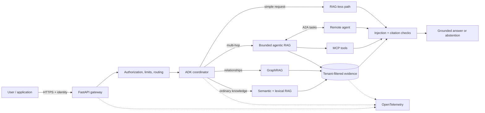

# AgentVerse

Production-oriented Python monorepo for building, evaluating and deploying generative-AI and
agentic systems with Google Agent Development Kit (ADK).

[](https://github.com/biswajitNanda223/AgentVerse/actions/workflows/ci.yml)
[](pyproject.toml)
[](https://google.github.io/adk-docs/)
[](LICENSE)

AgentVerse connects the complete path from user prompt to grounded response: authenticated API,
ADK orchestration, RAG-less routing, semantic/hybrid/GraphRAG/agentic retrieval, OCR, MCP tools,
A2A delegation, citation validation, OpenTelemetry, evaluation and deployment. Small examples
remain independently runnable, while a separate vertical solution shows how the parts fit
together.

> Reference baseline: Python 3.11–3.13, Google ADK 2.9.2, A2A SDK 1.1.4 and MCP 2.2.0.
> Dependencies are pinned deliberately; upgrade only with tests, evaluations and a canary.

## Start here

| Goal | Entry point |
|---|---|
| Run the complete prompt-to-user system | [Agentic RAG end-to-end solution](solutions/agentic_rag_end_to_end/README.md) |
| Learn every RAG strategy | [RAG examples](examples/rag/README.md) |
| Compare chunking strategies | [Chunking examples](examples/chunking/README.md) |
| Understand architecture and boundaries | [Architecture guide](docs/architecture.md) |
| Make agents fast, secure and scalable | [Production guide](docs/production-guide.md) |
| Use ADK, MCP, A2A and Agents CLI | [Agents and protocols](docs/agents-and-protocols.md) |
| Deploy with containers or Kubernetes | [Deployment runbook](docs/deployment.md) |
| Browse all documentation | [Documentation index](docs/README.md) |

## Capabilities

- **Google ADK:** grounded root agents, narrow typed tools, Agents CLI lifecycle and guarded
  orchestration.
- **RAG:** naive lexical, dense semantic, hybrid, reranked, parent-child, multi-query, HyDE,
  contextual, CRAG, Self-RAG, adaptive, federated, conversational, SQL, temporal, GraphRAG,
  multimodal and bounded agentic multi-hop retrieval.
- **Chunking:** fixed-window, sentence, paragraph, recursive, semantic, Markdown, HTML,
  layout-aware PDF/OCR, parent-child, contextual, late, code, table and proposition strategies.
- **Protocols:** standalone MCP 2.x tool servers and A2A discovery, client delegation and
  `message/send` peer examples.
- **Backend:** versioned FastAPI contracts, authentication, tenant isolation, request IDs,
  health probes, validation and structured errors.
- **Production controls:** checkpointing, idempotency, human-approval policy, prompt-injection
  screening, citation verification, provenance, context compaction and failure-specific recovery.
- **Operations:** OpenTelemetry, golden evaluations, load testing, CI, Docker Compose,
  Kubernetes security contexts, HPA and PodDisruptionBudget.

## Architecture



The default orchestration rule is simple: parallelize independent reads, then give one component
ownership of synthesis and every shared write. External side effects require approval,
idempotency and a durable checkpoint.

## Quick start

Prerequisites: Python 3.11–3.13 and [uv](https://docs.astral.sh/uv/).

```bash
git clone https://github.com/biswajitNanda223/AgentVerse.git
cd AgentVerse
cp .env.example .env
uv sync --extra dev
uv run pytest tests solutions/agentic_rag_end_to_end/tests
uv run uvicorn agentverse.api.app:create_app --factory --reload
```

Open `http://localhost:8000/docs`. The local deterministic retrieval examples do not require a
model key. Set `GOOGLE_API_KEY` or configure Vertex AI credentials for live ADK model calls.

### Run the complete one-shot solution

```bash
uv run uvicorn solutions.agentic_rag_end_to_end.app.api:create_app --factory --reload
```

In another terminal:

```bash
curl -X POST http://localhost:8000/v1/documents \
  -H "x-api-key: local-only" -H "x-tenant-id: demo" \
  -H "content-type: application/json" \
  -d '{"documents":[{"id":"guide","text":"Semantic RAG retrieves meaning. Graph RAG follows relationships.","source_uri":"memory://guide"}]}'

curl -X POST http://localhost:8000/v1/ask \
  -H "x-api-key: local-only" -H "x-tenant-id: demo" \
  -H "content-type: application/json" \
  -d '{"question":"Compare semantic and graph retrieval","mode":"agentic"}'
```

Windows PowerShell users can replace `cp` with `Copy-Item` and use `Invoke-RestMethod` instead
of `curl` if `curl` is not installed.

## RAG and chunking catalog

| Area | Implemented families |
|---|---|
| Retrieval | lexical, dense, hybrid RRF, reranking, federated |
| Query transformation | multi-query, HyDE, conversational condensation |
| Corrective and adaptive | CRAG, Self-RAG, adaptive routing, RAG-less path |
| Structured knowledge | SQL, temporal, GraphRAG |
| Agentic and multimodal | bounded multi-hop, multi-source, image/OCR representation fusion |
| Text chunking | fixed, sentence, paragraph, recursive, semantic |
| Structure-aware chunking | Markdown, HTML, PDF/OCR layout, code, table, proposition |
| Context strategies | parent-child, contextual and late chunking |

Each example uses deterministic local adapters so it can run without cloud credentials. These
adapters teach contracts and control flow; the production guide identifies the durable stores,
identity, queues, models and policy services required for real traffic.

## Repository structure

```text
AgentVerse/
├── src/agentverse/
│   ├── agents/          ADK agents, tools, guardrails and reliability controls
│   ├── api/             standalone FastAPI integration
│   ├── core/            settings, security, errors and telemetry
│   ├── production/      failure recovery and provenance
│   ├── protocols/       standalone MCP and A2A adapters
│   └── rag/             chunking, retrieval, OCR and RAG strategies
├── solutions/
│   └── agentic_rag_end_to_end/  complete prompt-to-user vertical solution
├── examples/
│   ├── rag/             independently runnable RAG patterns
│   ├── chunking/        independently runnable chunking patterns
│   └── production_patterns/
├── tests/               unit and API tests
├── evals/               golden retrieval cases
├── docs/                architecture and operational guides
├── deploy/              Docker, Compose, OTel and Kubernetes assets
└── references/          attachment review and traceability notes
```

## Quality and operations

```bash
# Static quality
uv run ruff check .
uv run ruff format --check .
uv run mypy src/agentverse solutions/agentic_rag_end_to_end/app

# Tests and coverage
uv run pytest tests solutions/agentic_rag_end_to_end/tests \
  --cov=agentverse --cov=solutions.agentic_rag_end_to_end.app

# ADK lifecycle
uvx google-agents-cli setup
agents-cli playground
agents-cli eval run

# Supporting services
docker compose -f deploy/docker-compose.yml up --build
```

Before production, replace local in-memory adapters with durable tenant-aware stores, managed
identity and secrets, queued ingestion, explicit network policy and an approved telemetry
backend. Run retrieval, answer-quality, agent-trajectory, security and load gates before every
release. See the [production guide](docs/production-guide.md) for the complete checklist.

## Contributing and security

Changes should include focused tests and update the relevant documentation in the same pull
request. Do not put credentials, personal data or unrestricted prompt content in examples,
fixtures or telemetry. Report vulnerabilities through GitHub security advisories as described
in [SECURITY.md](SECURITY.md).

## License

Apache-2.0. See [LICENSE](LICENSE).
