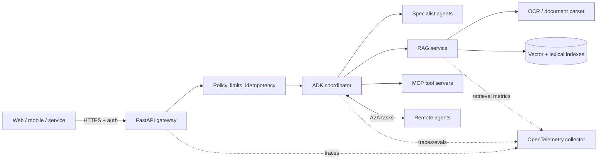

# AgentVerse

AgentVerse is an end-to-end, production-oriented learning monorepo for building fast,
accurate and secure generative-AI systems with **Google ADK (Python)**. It keeps the
examples separate: the REST API, RAG/OCR pipeline, MCP server and A2A agent can each run
alone, while sharing configuration, security, telemetry and evaluation patterns.

> Current reference baseline (September 2026): Python 3.11-3.13, Google ADK 2.9.2,
> A2A SDK 1.1.4 and MCP 2.2.0. Pinning is deliberate; upgrade with tests and evals.

## What is included

- ADK agents: focused single agent, coordinator/sub-agent workflow, guarded tools,
  durable session guidance and an `agents-cli` lifecycle.
- RAG: naive, hybrid, reranked, parent-child, multi-query, HyDE, contextual, corrective
  (CRAG), self/agentic, graph and multimodal design examples.
- Chunking: fixed token-window, sentence/paragraph, recursive, semantic, document-aware,
  parent-child and late/contextual chunking trade-offs plus executable strategies.
- OCR: image/PDF ingestion with validation, provenance and a pluggable extraction boundary.
- Protocols: MCP for agent-to-tool/data integration; A2A for agent-to-agent discovery and
  delegation. They solve different problems and are demonstrated separately.
- Backend: versioned FastAPI endpoints, request IDs, API-key boundary, size limits,
  health/readiness, idempotency and structured errors.
- Production: OpenTelemetry traces/metrics/log correlation, Docker, Kubernetes, network
  policy, HPA, PodDisruptionBudget, CI, threat model and evaluation gates.

## Architecture



## Quick start

```bash
cp .env.example .env
uv sync --extra dev
uv run pytest
uv run uvicorn agentverse.api.app:create_app --factory --reload
```

Open `http://localhost:8000/docs`. The deterministic local RAG endpoint works without a
model key. To run ADK model calls, set `GOOGLE_API_KEY` or configure Vertex AI credentials.

```bash
# ADK developer UI / CLI lifecycle
uvx google-agents-cli setup
agents-cli playground
agents-cli eval run

# Entire local supporting stack
docker compose -f deploy/docker-compose.yml up --build
```

## Learning paths

1. [Architecture and design](docs/architecture.md)
2. [RAG and chunking handbook](docs/rag-handbook.md)
3. [ADK agents, MCP, A2A and Agents CLI](docs/agents-and-protocols.md)
4. [Performance, accuracy, security and observability](docs/production-guide.md)
5. [Deployment runbook](docs/deployment.md)
6. [Attachment-derived requirements](references/ATTACHMENT_NOTES.md)

## Runnable strategy catalog

The complete examples are under [`examples/rag`](examples/rag) and
[`examples/chunking`](examples/chunking). They cover:

- RAG: naive lexical, dense, hybrid, reranked, parent-child, multi-query, HyDE, CRAG,
  Self-RAG, adaptive, federated, agentic multi-hop, graph, multimodal, conversational,
  SQL/structured and temporal retrieval.
- Chunking: fixed, sentence, paragraph, recursive, semantic, Markdown/document-aware,
  parent-child, contextual, late, Python-code and CSV-table chunking.
  HTML blocks, PDF/OCR layout elements and proposition chunking are also included.

These are executable local references, not claims that one strategy fits every corpus. Choose
with the decision matrix in the RAG handbook, then prove the choice using retrieval evals.

## Repository map

```text
src/agentverse/
  agents/       ADK definitions; coordinator and specialists
  api/          standalone FastAPI integration
  core/         config, errors, security, telemetry
  rag/          ingestion, chunking, retrieval and CRAG orchestration
  protocols/    standalone MCP and A2A examples
tests/          unit, API and architecture tests
docs/           conceptual guides and Mermaid diagrams
deploy/         container, Compose and Kubernetes resources
evals/          golden retrieval and agent behavior datasets
examples/       one independently runnable example per strategy family
```

The examples use safe local defaults for teaching. The production checklist identifies
the external managed components (identity, secret manager, durable queues, databases and
telemetry backend) required before real traffic.

## Quality commands

```bash
uv run ruff check .
uv run ruff format --check .
uv run pytest --cov=agentverse
```

## License

Apache-2.0. See [LICENSE](LICENSE).
