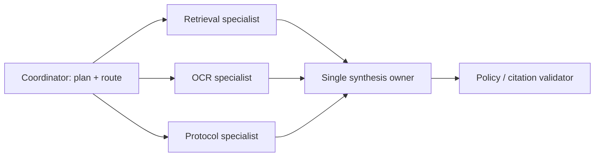

# ADK agents, MCP, A2A and Agents CLI

## Agent topology

The default sample uses one coordinator with bounded specialist tools. A production workflow
can replace these with ADK `ParallelAgent` read stages and a `SequentialAgent` synthesis stage.
Do not create agents merely to mirror an organization chart: every extra agent adds model
calls, failure modes, permissions and context-transfer cost.



ADK tools should be narrow Python functions with precise docstrings, typed parameters,
timeouts and structured results. Keep deterministic transformations outside the model.

## MCP versus A2A

| Concern | MCP | A2A |
|---|---|---|
| Relationship | agent/client to tool, resource or prompt server | agent to autonomous peer agent |
| Discovery | server capabilities | Agent Card and skills |
| Unit of work | tool/resource request | task, message, artifact and status |
| Typical use | search DB, invoke internal API, read schema | delegate research to another agent |
| Trust | explicit allowlist, OAuth/scopes, input validation | authenticated peer, task-level authorization |

Never forward end-user bearer tokens blindly to either protocol. Use audience-bound tokens,
least-privilege scopes, egress allowlists, SSRF protection, timeouts, schema validation and
human approval for consequential tools.

## Agents CLI lifecycle (2026)

```bash
uvx google-agents-cli setup
agents-cli create my-agent --prototype --yes
agents-cli install
agents-cli playground
agents-cli run "Explain hybrid RAG"
agents-cli eval run
agents-cli scaffold enhance --deployment-target cloud_run
agents-cli deploy
agents-cli deploy --status
```

Agents CLI also supports trace generation/grading, dataset synthesis and experimental prompt
optimization. Treat optimization output as a proposed code change: review it, run safety and
quality evals, canary it, and retain rollback metadata.

