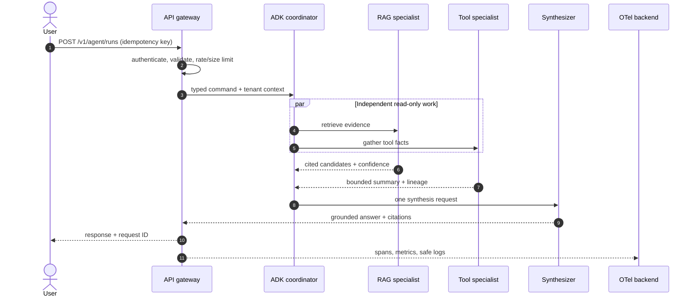

# Architecture and design

## Design principles

1. Start with one capable agent and deterministic tools. Add multiple agents only when
   isolation, ownership, permissions or independently scalable work justifies coordination.
2. Separate the control plane (plans, policies, routing) from the data plane (retrieval,
   models, tools). A model never receives infrastructure credentials.
3. Every boundary is typed, time-bounded, observable and independently testable.
4. Retrieval returns evidence plus provenance; generation is not allowed to invent citations.
5. Parallelize independent reads. Give a single component ownership of shared writes and the
   final decision. This removes merge races and contradictory agent output.

## Request flow

## Monorepo boundaries

- `core` has no framework imports and can be reused by every service.
- `rag` owns document lifecycle and evidence contracts, not HTTP or ADK state.
- `agents` maps deterministic capabilities into ADK tools and workflow agents.
- `api` translates HTTP into application commands. It does not contain retrieval logic.
- `protocols` exposes small adapter processes. MCP and A2A are not hidden inside the API.
- `solutions/agentic_rag_end_to_end` assembles those boundaries into one runnable vertical
  slice while keeping protocol processes independently deployable.

## State and side effects

Use ephemeral ADK session state for a turn, a durable session store for resumable state,
PostgreSQL for business records/idempotency, object storage for full tool artifacts and a
vector/lexical index for derived retrieval data. Before a resumable workflow performs an
external write, persist the intended operation and an idempotency key. On replay, return the
recorded result instead of repeating the side effect.
