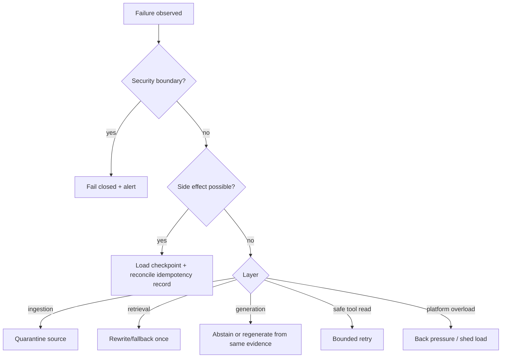

# Attachment engineering playbook

This document turns the nine supplied screenshots into maintained, testable engineering
requirements. The screenshots are commentary and illustrations, not normative specifications.
Current protocol/framework behavior remains sourced from official ADK, MCP, A2A and
OpenTelemetry documentation.

Run the complete attachment-derived example:

```bash
uv run python examples/production_patterns/attachment_lessons.py
```

## Traceability matrix

| Attachment lesson | Failure if ignored | Implementation | Verification |
|---|---|---|---|
| Learn failure modes before tools | teams retry the wrong layer or hide retrieval failures as model errors | `production/failures.py` | `test_production_patterns.py` |
| RAG quality is chunking, retrieval, context and evaluation | a connected vector store returns confident irrelevant answers | `rag/advanced_chunking.py`, `rag/strategies.py`, `evals/` | chunking/retrieval strategy tests |
| CRAG graders need the original query and candidate | relevance grading without intent accepts superficially related text | `CorrectiveRag._grade(query, candidates)` | `test_corrective_rag_uses_original_query_for_grading` |
| Resuming workflows can replay side effects | duplicate emails, payments or mutations | `CheckpointStore`, `IdempotencyStore` | `test_idempotency_prevents_replay_and_argument_drift` |
| Parallelize independent outputs, not one shared decision | conflicting writes and nondeterministic final answers | `safe_parallel_groups`; single synthesis in `AgenticRag` | `test_checkpoint_compaction_parallelism_and_policy` |
| Network boundaries need provenance | a bad output is contained but cannot be attributed or audited | `production/provenance.py` | tenant/content tamper tests |
| Raw tool payloads bloat active context | higher cost, latency and distraction on every following turn | `compact_tool_payload` | artifact reference and bounded-summary test |
| Ingest → index → retrieve → augment → generate | monolithic code cannot isolate or evaluate failure stages | typed `Document`, `Chunk`, `Retriever`, `RagAnswer` boundaries | API and end-to-end tests |

## Failure-first operations

Do not implement a global “retry three times” decorator. Recovery depends on the layer and on
whether a side effect may already have happened:



Every failure event should record layer, stable code, retryability, side-effect possibility,
request/run IDs and trace ID. Exception strings are diagnostics, not stable policy inputs.

## Query-aware corrective RAG

The grader contract is `(original_query, candidate) -> relevance`, never just `candidate ->
relevance`. Retrieve broadly, grade against intent, keep candidates above an evaluated threshold,
and perform at most one bounded rewrite/fallback before abstaining. Track correction rate,
post-correction recall, added latency and whether correction improved the final answer.

## Checkpoint and idempotency protocol

Before an external write:

1. Derive a tenant-scoped idempotency key from the logical operation.
2. Persist intent and canonical argument fingerprint transactionally.
3. Perform the operation with the same provider idempotency key when supported.
4. Persist the result and side-effect identifier.
5. Advance the checkpoint monotonically.

On resume, reconcile the stored operation before retrying. Reusing a key with different
arguments is an error, not a cache hit.

## Safe multi-agent parallelism

Parallel work is appropriate when outputs are disjoint findings, cited evidence or separate
artifacts. If multiple agents can write the same file, decision or external record, serialize
the write or appoint one owner. The standard topology is parallel read-only specialists followed
by exactly one synthesis/writer stage.

## Context compaction and audit

Persist full tool output in an access-controlled artifact store under a content hash. Put only
a bounded summary plus artifact reference in model context. This preserves lineage and forensic
detail without repeatedly paying tokens for raw payloads. Summaries are derived data: retain the
hash, tool/version, tenant, policy decision and source reference.

## Provenance minimum

Every material answer or artifact must be traceable to request ID, tenant, agent version, prompt
version, model version, index version, source URI and evidence content hash. Verify tenant and
content hash before using cached or delegated evidence. Provenance failures fail closed.

## Documentation maintenance

When an implementation changes, update this matrix in the same pull request. CI runs the linked
tests. Raw screenshots stay outside Git because they include third-party social-media content;
`references/ATTACHMENT_NOTES.md` retains the review record.

