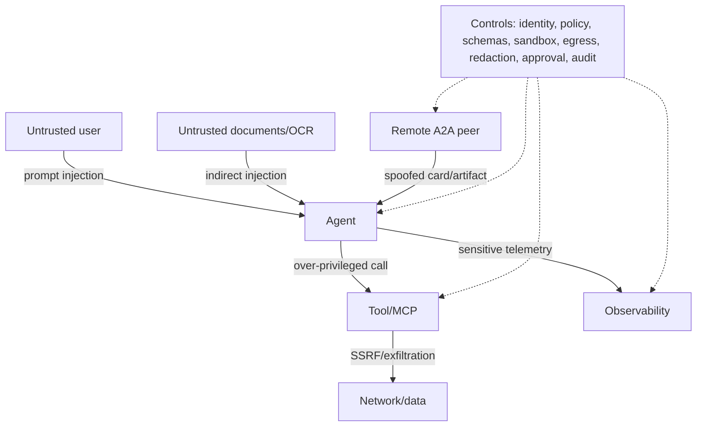

# Performance, accuracy, security and observability

## Make agents fast and scalable

- Route simple requests to a smaller/faster model; escalate only on measured uncertainty.
- Stream early, cap tool/model time, use cancellation and enforce an end-to-end deadline.
- Cache immutable embeddings and safe retrieval results with tenant/model/index-version keys.
- Batch ingestion and embeddings; never make the request path rebuild an index.
- Use async I/O and bounded concurrency. Back pressure with a durable queue for ingestion.
- Parallelize independent reads, then use one synthesis owner. Avoid parallel shared writes.
- Keep model workers stateless; externalize sessions, checkpoints and idempotency records.
- Autoscale on queue depth/concurrency and latency, not CPU alone. Maintain provider quotas.
- Bound context by relevance and token budget. Summarize tool payloads but preserve full
  artifacts outside the window for audit.

## Failure taxonomy

| Layer | Failure examples | Detection | Response |
|---|---|---|---|
| Ingestion | corrupt file, OCR/layout loss, stale ACL | parse/OCR confidence, freshness SLO | quarantine, retry, review |
| Retrieval | no recall, wrong tenant, duplicate chunks | recall@k, ACL tests, diversity | rewrite, fallback, fail closed |
| Generation | unsupported claim, bad citation, refusal drift | faithfulness/citation eval | regenerate, abstain, human review |
| Tool | timeout, schema drift, partial side effect | spans, contract test, idempotency log | retry safe reads, reconcile writes |
| Orchestration | loop, deadlock, replay, conflicting writers | step/deadline counters | checkpoint, single writer, terminate |
| Platform | quota, overload, dependency outage | saturation/error SLOs | shed load, queue, circuit break |

## Security baseline

- Authenticate at the edge and authorize every document/tool action using tenant and subject.
- Apply retrieval ACL filters before scoring/output. Test cross-tenant isolation continuously.
- Treat prompts, documents, OCR text, MCP/A2A output and tool descriptions as untrusted data.
- Separate instructions from evidence; allowlist tools and parameters; require approval for
  deletion, payment, external messaging, permission changes and code execution.
- Store secrets in a secret manager, rotate them, use workload identity and deny model access.
- Sandbox code/file processing with read-only roots, no default egress and resource ceilings.
- Redact PII/secrets before logs and model calls; configure retention and data residency.
- Sign and scan images, generate SBOMs, pin dependencies and verify provenance in CI.
- Record lineage: request, tenant, agent/version, prompt/version, model, tools, evidence and
  policy decision. Network policy without this provenance only relocates failures.

## Threat model

## Telemetry

Propagate W3C trace context and a safe request ID. Emit spans for HTTP, agent step, model call,
retrieval, rerank, tool/MCP/A2A call and storage. Metrics should include request latency/errors,
active runs, tokens/cost, time-to-first-token, tool latency, retrieval scores, no-answer rate,
loop/step count and queue depth. Logs carry trace IDs and structured safe fields, never raw
prompts by default. Content capture is opt-in, sampled, redacted, access-controlled and retained
separately.

Service-level objectives need both reliability and quality, for example: 99.9% successful
accepted requests; p95 under the product-specific deadline; retrieval recall@10 above the
validated threshold; citation precision above threshold; and zero cross-tenant evidence.

