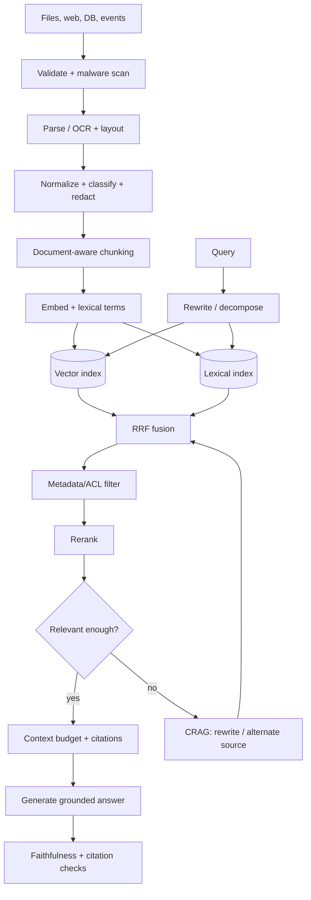

# RAG and chunking handbook

## End-to-end pipeline

## RAG variants and when to use them

| Variant | Mechanism | Good fit | Main risk |
|---|---|---|---|
| Naive | dense top-k then generate | prototype, clean small corpus | misses exact IDs and terminology |
| Hybrid | dense + BM25, reciprocal-rank fusion | most production text search | tuning two indexes |
| Reranked | retrieve wide, cross-encoder/LLM rerank narrow | quality-sensitive Q&A | latency and cost |
| Parent-child | retrieve small child, send larger parent | long manuals and policies | parent context bloat |
| Multi-query | generate query variants, fuse results | ambiguous user language | duplicate/noisy recall |
| HyDE | retrieve using a hypothetical answer embedding | sparse or question-like corpora | hypothetical bias |
| Contextual | prepend document/section context before embedding | chunks with lost local meaning | ingestion cost |
| CRAG | grade results; rewrite or use alternate source | variable-quality corpora | grader adds latency |
| Self-RAG | model decides whether/what to retrieve and critiques | complex knowledge tasks | harder evaluation |
| Agentic RAG | plan/decompose, use multiple stores/tools | research and multi-hop questions | loops, cost, permissions |
| Graph RAG | traverse entities/relations plus text evidence | relationship-heavy domains | graph construction/refresh |
| Multimodal | retrieve text, image/page/layout embeddings | scans, charts, slide decks | modality alignment |

## Chunking decision table

| Strategy | Use when | Starting point | Do not use when |
|---|---|---|---|
| Fixed window | homogeneous logs/transcripts | 350-600 tokens, 10-20% overlap | headings/layout carry meaning |
| Paragraph/sentence | prose has clean punctuation | group to token budget | OCR punctuation is unreliable |
| Recursive | mixed Markdown/HTML/plain text | heading → paragraph → sentence | tables/code require atomic units |
| Document-aware | PDF, code, tables, policies | split by semantic element | parser cannot preserve structure |
| Semantic | topic shifts inside long sections | embedding breakpoint threshold | ingestion must be very cheap |
| Parent-child | answers need surrounding clauses | 150-token child, 800-token parent | corpus is already short |
| Contextual/late | isolated chunks are ambiguous | add title/section summary | context generation cost is unjustified |
| Code/table | syntax or row/column structure must remain valid | AST definitions / header + row groups | treating source as prose |
| HTML/PDF layout | DOM blocks, pages and coordinates carry meaning | semantic blocks and parser elements | flattening reading order is acceptable |
| Proposition | high-precision atomic facts | evaluated proposition decomposer | narrative context is required |

Treat these as hypotheses. Tune chunk size, overlap, `k`, fusion and reranking using a
versioned query set with expected evidence, not intuition. Record recall@k, MRR/nDCG,
faithfulness, citation precision, answer completeness, p50/p95 latency and cost per answer.

## Implementation map

| Family | Implementation | Runnable example |
|---|---|---|
| Naive lexical | `rag/retrieval.py` | `examples/rag/01_naive` |
| Dense, hybrid, reranked | `rag/strategies.py` | `examples/rag/02_dense`–`04_reranked` |
| Parent-child | `advanced_chunking.py`, `ParentDocumentRetriever` | `examples/rag/05_parent_child` |
| Multi-query and HyDE | `MultiQueryRetriever`, `HyDERetriever` | `examples/rag/06_multi_query`, `07_hyde` |
| Corrective RAG | `rag/pipeline.py` | `examples/rag/08_crag` |
| Self/adaptive RAG | `SelfRag`, `AdaptiveRag` | `examples/rag/09_self_adaptive` |
| Federated/agentic | `FederatedRetriever`, `AgenticRag` | `examples/rag/10_agentic_federated` |
| Graph | `GraphRetriever` | `examples/rag/11_graph` |
| Multimodal | `MultimodalRetriever` | `examples/rag/12_multimodal` |
| Conversational | `ConversationalRetriever` | `examples/rag/13_conversational` |
| SQL and temporal | `SqlRag`, `TemporalRetriever` | `examples/rag/14_sql_temporal` |

Graph and multimodal examples are intentionally small: production GraphRAG additionally needs
entity resolution, community detection/summaries and graph refresh evaluation; production
multimodal RAG needs modality-specific encoders, page/region coordinates and artifact storage.
The interfaces demonstrate the flow without pretending that an in-memory example is a managed
index.

## OCR

OCR is an ingestion fallback, not a single function call. Detect native text first; render
only pages needing OCR; correct orientation; preserve page/bounding-box provenance; calculate
confidence; route low-confidence pages for review; then reconstruct reading order, tables and
headings. Never discard the original file or raw OCR artifact. `OcrExtractor` implements the
local Tesseract boundary; managed OCR/document-AI systems can implement the same protocol.

## Accuracy loop

1. Build 30-100 representative queries including no-answer, adversarial and permission cases.
2. Label expected evidence independently from expected prose.
3. Optimize retrieval recall first, reranker precision second, answer faithfulness third.
4. Slice metrics by source, language, OCR confidence, document age and question type.
5. Add every production failure to the regression set after redaction and approval.
