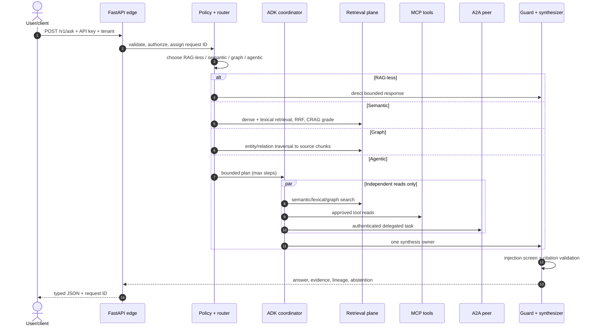

# Agentic RAG end-to-end production slice

This folder is a cohesive, one-shot vertical example. It is deliberately separate from the
small strategy examples: one request travels from an authenticated user-facing API through
routing, ADK-compatible orchestration, semantic/hybrid/graph/agentic retrieval, MCP/A2A
boundaries, guardrails and citation validation to a final response.

The local defaults run without cloud credentials. Production substitutions are explicitly
identified below; an in-memory demo is not mislabeled as a durable production database.

## Folder structure

```text
agentic_rag_end_to_end/
  app/
    api.py             versioned user and ingestion API
    models.py          typed external contracts
    router.py          RAG-less/semantic/graph/agentic routing
    orchestrator.py    bounded one-shot control plane
    adk_agent.py       Google ADK root agent and tool
    mcp_server.py      standalone MCP 2.x read-only server
    a2a.py             deadline-bound A2A peer client
    a2a_server.py      A2A Agent Card + message/send peer
    settings.py        environment configuration
  tests/               route, retrieval, API and protocol tests
  evals/               route/evidence/no-answer golden cases
  load/                k6 arrival-rate load test and SLO thresholds
  Dockerfile           non-root immutable container
  docker-compose.yml   API and A2A peer local topology
  k8s.yaml             probes, limits, HPA and disruption budget
  agents-cli-manifest.yaml
  .env.example
  README.md
```

## Prompt-to-user flow



## Modes

| Mode | What happens | Best fit |
|---|---|---|
| `ragless` | skips retrieval | greeting, formatting, safe deterministic tool task |
| `semantic` | dense + lexical fusion followed by corrective relevance filtering | ordinary knowledge Q&A |
| `graph` | traverses entity/relation edges and returns source chunks | dependencies, ownership and relationship questions |
| `agentic` | bounded subqueries across semantic, lexical and graph sources | comparisons and multi-hop investigations |
| `auto` | deterministic router selects one of the above | normal API traffic |

Routing is observable and returned in `steps`. In production, train/evaluate a router against
real traffic, retain deterministic overrides and fail closed on low confidence.

## Run locally

From the repository root:

```bash
copy solutions\agentic_rag_end_to_end\.env.example solutions\agentic_rag_end_to_end\.env
uv sync --extra dev
uv run uvicorn solutions.agentic_rag_end_to_end.app.api:create_app --factory --reload
```

Ingest data:

```bash
curl -X POST http://localhost:8000/v1/documents \
  -H "x-api-key: local-only" -H "x-tenant-id: demo" \
  -H "content-type: application/json" \
  -d '{"documents":[{"id":"guide","text":"Hybrid RAG combines semantic and lexical retrieval. Graph RAG connects entities to evidence.","source_uri":"memory://guide"}]}'
```

Ask one end-to-end question:

```bash
curl -X POST http://localhost:8000/v1/ask \
  -H "x-api-key: local-only" -H "x-tenant-id: demo" \
  -H "content-type: application/json" \
  -d '{"question":"Compare semantic and graph retrieval","mode":"agentic"}'
```

Run each protocol separately:

```bash
# ADK / Agents CLI
agents-cli playground
agents-cli eval run

# MCP over stdio
uv run python -m solutions.agentic_rag_end_to_end.app.mcp_server

# A2A peer
uv run uvicorn solutions.agentic_rag_end_to_end.app.a2a_server:app --port 8001

# Container topology
docker compose -f solutions/agentic_rag_end_to_end/docker-compose.yml up --build
```

## How the code maps to production

| Local component | Production replacement |
|---|---|
| `HashEmbedder` | versioned managed/self-hosted embedding model |
| in-memory chunks | object store + document registry + durable ingestion status |
| in-memory dense index | Qdrant/pgvector/managed vector search with tenant/ACL filters |
| local lexical index | OpenSearch/Elasticsearch/BM25 service |
| co-occurrence graph | entity/relation extraction, canonicalization and graph database |
| extractive generator | ADK model call with bounded evidence and structured output |
| API key | OIDC workload/user identity, gateway quotas and authorization service |
| synchronous ingestion | durable queue, idempotent workers, DLQ and index-version promotion |
| local A2A peer | mutually authenticated, allowlisted peer with audience-bound OAuth token |

## Fast and scalable design

- Keep API workers stateless. Put sessions, checkpoints and idempotency in durable stores.
- Move parsing/OCR/chunking/embedding to queued workers; promote immutable index versions.
- Batch embeddings and deduplicate by normalized-content hash.
- Apply tenant/ACL filters inside every retrieval store before candidates leave it.
- Use `ragless` routing for simple traffic; semantic retrieval for ordinary questions; reserve
  GraphRAG and agentic fan-out for queries whose measured quality gain pays for the latency.
- Run independent read stages concurrently with a strict deadline and cancellation. Only one
  component writes the final answer or shared state.
- Retrieve wide cheaply, rerank narrowly, then cap evidence by token budget and diversity.
- Cache by tenant, normalized query, embedding model and index version. Never share tenant keys.
- Scale online pods by active requests/latency and ingestion workers by queue depth. Provider
  quotas and downstream concurrency are hard capacity limits even when Kubernetes can add pods.
- Stream model output only after evidence/policy validation allows the response class.

Suggested latency budget for an interactive request:

```text
edge/auth 50 ms → route 20 ms → retrieval 300 ms → rerank 250 ms
→ model first token 800 ms → streamed completion within product SLO
```

Graph/agentic requests need a different SLO and budget. Do not hide 20-second research tasks
behind an endpoint designed for two-second chat responses; return a task ID and stream status.

## Security and reliability gates

- Authenticate once, authorize every source/tool, and propagate tenant/subject—not bearer tokens.
- Treat user input, indexed text, OCR, MCP output and A2A artifacts as untrusted.
- Allowlist tools and peer domains; block arbitrary URLs and private-network SSRF targets.
- Require signed human approval for external writes; bind approval to tool, arguments and expiry.
- Persist an idempotency key before side effects; checkpoint after confirmed completion.
- Cap request bytes, history, candidates, agent steps, tool time and total deadline.
- Validate structured model output and citation indexes; abstain on missing/invalid evidence.
- Redact telemetry; prompt/content capture is opt-in with separate access and retention.
- Sign/scan images, emit an SBOM and deploy by digest with workload identity and default-deny
  network policy.

## Observability and evaluation

One trace should contain spans for edge/auth, route, ADK step, each retrieval store, fusion,
reranking, MCP/A2A calls, guardrails and generation. Attach request, tenant hash, agent/prompt/model
version, index version, mode, candidate count, tokens, cost and cache status. Never attach raw
secrets or unrestricted prompt content.

Release gates:

1. Retrieval: recall@k, MRR/nDCG, ACL leakage and graph path correctness.
2. Answer: faithfulness, citation precision/recall, completeness and correct abstention.
3. Agent: route accuracy, tool selection, step count, loop rate and side-effect policy.
4. Platform: p50/p95/p99, time to first token, saturation, cost and dependency failure tests.
5. Security: injection, cross-tenant, SSRF, malformed MCP/A2A, replay and approval-bypass suites.

Canary model, prompt, agent, index and policy versions independently. Store all five versions on
the trace and retain an immediate rollback path.
