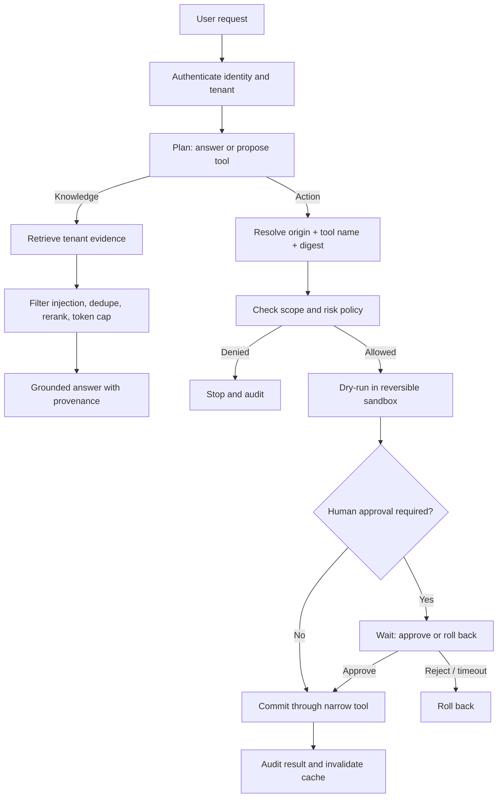

# Production AI Security

A runnable, deterministic reference for building an agent that can retrieve knowledge, remember
useful facts, and call tools without trusting the model to enforce security. It turns the ideas in
the accompanying engineering notes into code: rollback-first consent, least-privilege tools,
origin-bound skill resolution, retrieval and trajectory evaluation, adversarial testing, secure
memory, tenant-safe caching, and tamper-evident auditing.

No model key or paid LLM call is required. The point is to make the control plane observable and
testable before a model is plugged in.

## In plain English

Think of the model as a smart new employee. It may suggest what to do, but it does not get the
master key. A security layer checks who asked, what narrow permission they have, where the tool
came from, and what damage the action could cause. The action is first rehearsed in a sandbox.
Only then can policy—or a person for sensitive work—allow the real action.

Memory and retrieved documents are treated like notes from strangers: useful, but not trusted as
instructions. They are screened, separated by customer, given expiry dates, and discarded when
irrelevant. Every important decision goes into a hash-chained audit log.

## Secure agentic flow



The crucial boundary is between **preview** and **commit**. The model can reach preview; policy and
human consent control commit.

## Folder structure

```text
production_ai_security/
├── app/
│   ├── audit.py          append-only hash-chained security events
│   ├── cache.py          tenant/policy/source-version cache isolation
│   ├── evaluation.py     retrieval, trajectory, and invariant checks
│   ├── memory.py         write/read gates, TTL, tenant deletion
│   ├── models.py         typed security states and contracts
│   ├── orchestrator.py   secure agent control loop
│   ├── policy.py         deterministic scope and risk decisions
│   ├── retrieval.py      filter, rerank, dedupe, and context cap
│   ├── sandbox.py        propose → preview → approve/rollback → commit
│   ├── tools.py          least-privilege origin-bound tool registry
│   └── demo.py           local runnable example
├── docs/
│   ├── threat-model.md   assets, trust boundaries, abuse cases, controls
│   └── operations.md     production rollout and incident runbook
└── tests/
    └── test_security_flow.py
```

## Run it

From the repository root:

```bash
uv run python -m solutions.production_ai_security.app.demo
uv run pytest solutions/production_ai_security/tests -q
```

## What each control prevents

| Control | Prevents | Code |
|---|---|---|
| Origin + name resolution | A malicious skill squatting a trusted name | `ToolRegistry.resolve` |
| Handler digest | Tool code changing after registration | `ToolRegistry.handler_digest` |
| Narrow tool contracts | A generic `run_sql` or shell tool bypassing policy | `read_orders`, `issue_refund_lt_100` |
| Explicit scopes | One credential gaining every capability | `PolicyEngine.decide` |
| Sandbox preview | Intent immediately becoming an external side effect | `ActionSandbox.propose` |
| Approval state | A model approving its own high-risk action | `ActionState.AWAITING_APPROVAL` |
| Request idempotency | Retries duplicating payments or messages | `_request_index` |
| Tenant filters | Data crossing customer boundaries | retrieval, memory, cache, action ownership |
| Write/read memory gates | Reflections becoming permanent poisoned facts | `SecureMemory` |
| Retrieval discard path | Bad or bloated context reaching the model | `SecureRetriever.search` |
| Trajectory evaluation | Correct answers produced through unsafe steps | `trajectory_policy` |
| Hash-chained audit | Silent rewriting of the local event history | `AuditLog.verify_chain` |

## Production integration boundaries

The in-memory adapters teach contracts, not infrastructure. Replace them with:

- workload identity plus a policy engine such as OPA/Cedar or a cloud authorization service;
- durable workflow/checkpoint storage and an outbox for exactly-once side effects;
- isolated workers with network egress allowlists, CPU/memory/time limits, and no ambient secrets;
- encrypted tenant-partitioned vector, cache, memory, and audit stores;
- signed tool manifests bound to publisher identity, origin, version, and digest;
- immutable audit export to your SIEM, with secret/PII redaction before export;
- independent retrieval, answer, trajectory, adversarial, and load gates in CI/CD.

See [Threat model](docs/threat-model.md) and [Operations runbook](docs/operations.md).
