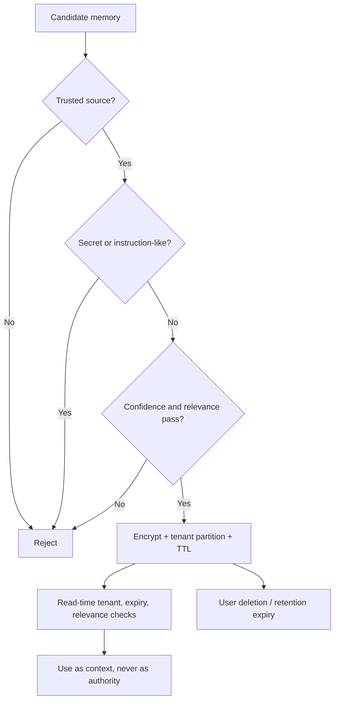

# Production Operations Runbook

## Before release

- Pin model, prompt, policy, tool manifest, embedding, reranker, and corpus versions.
- Run unit, retrieval, answer, trajectory, adversarial, and load suites independently.
- Verify every effectful tool has an idempotency key, timeout, retry policy, and compensating plan.
- Confirm workers have no ambient cloud permissions and egress is allowlisted.
- Confirm approval tokens bind action digest, approver, tenant, expiry, and one-time nonce.
- Test tenant deletion across primary data, memory, cache, vector indexes, logs, and backups.
- Set budget alerts for tokens, tool calls, cache misses, queue delay, and GPU utilization.

## Runtime signals

Alert on denied-action spikes, unknown tool origins, digest mismatches, retrieval abstention changes,
approval bypass attempts, cache cross-tenant invariant failures, memory rejection spikes, repeated
idempotency keys, tool latency, and audit export lag. Never log raw prompts, credentials, or full
customer records merely because tracing is enabled.

## Incident flow

```mermaid
flowchart LR
  Detect["Detect signal"] --> Contain["Disable tool/version; revoke identity"]
  Contain --> Preserve["Preserve audit, trace, policy, and manifest versions"]
  Preserve --> Scope["Find affected tenants and actions"]
  Scope --> Recover["Roll back staged work; compensate committed effects"]
  Recover --> Repair["Patch control and add failing regression eval"]
  Repair --> Canary["Canary with restricted traffic"]
  Canary --> Review["Post-incident review and customer notice if required"]
```

Do not “fix” an incident by deleting its traces. Redact access copies when necessary while
preserving the immutable evidence under the incident-retention policy.

## Scaling notes

- Keep reads parallel but serialize ownership of shared writes.
- Use backpressure and queues instead of letting agent concurrency overwhelm dependencies.
- Cache only after authorization; include tenant, purpose, policy version, and source version.
- Batch model traffic only within compatible privacy and latency classes.
- Benchmark tokens/second, memory bandwidth, queue delay, and utilization—not FLOPs alone.
- Smaller accelerators are economical only when traffic keeps them utilized; bursty traffic can
  make queueing and cold capacity dominate unit cost.

## Memory lifecycle

Gate both writes and reads. Write-time checks limit poisoning; read-time checks handle changed
permissions, stale facts, new policy, and relevance.
