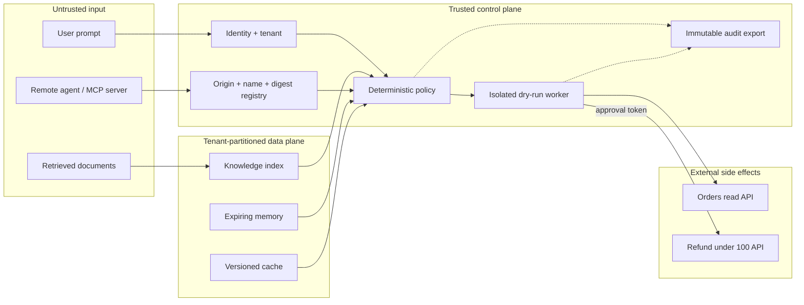
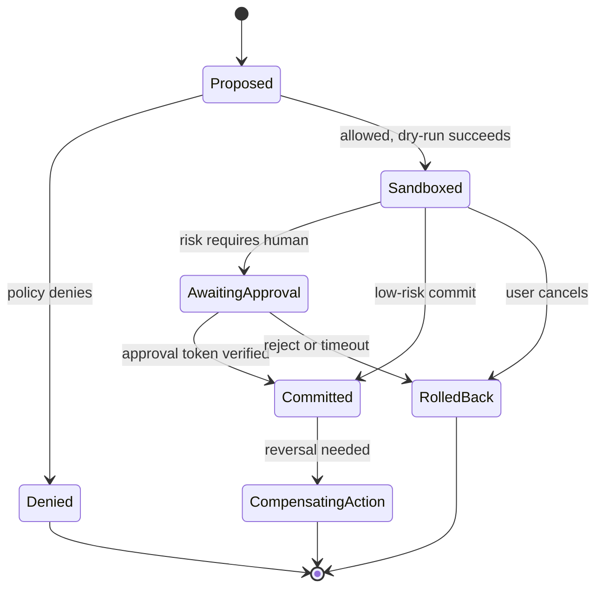

# Threat Model

## What we protect

- customer data and tenant boundaries;
- credentials, model prompts, memory, and retrieved context;
- external systems reached through tools;
- approvals, audit history, and evaluation results;
- service availability and inference budget.

## Trust boundaries

Arrows crossing from untrusted input never go directly to an effect. Retrieved text is data, not
authority. A digest proves bytes arrived unchanged; it does **not** prove those bytes are safe or
from the right publisher, so origin identity remains mandatory.

## Abuse cases and controls

| Abuse case | Example | Primary controls | Safe failure |
|---|---|---|---|
| Prompt injection | A document says “ignore policy” | Treat content as data, pattern screening, narrow tools | Drop document and log |
| Namespace collision | Attacker publishes `read_orders` | Resolve `origin::name`, signed manifest, allowlist | Unknown origin fails closed |
| Excess privilege | Agent has one all-powerful API key | Per-tool scopes and workload identity | Deny missing scope |
| Consent bypass | Model directly sends/refunds | Dry-run state machine and external approval token | Stay reversible |
| Retry duplication | Network timeout repeats a refund | Tenant + request idempotency key and outbox | Return original action |
| Memory poisoning | Model stores its own guess as fact | Confidence/source/TTL gates on write and read | Reject or expire memory |
| Cross-tenant leak | Shared cache returns another customer's answer | Tenant in every key and storage partition | Cache miss |
| Retrieval failure | Plausible answer from wrong chunks | Measure retrieval before generation; require provenance | Abstain |
| Unsafe trajectory | Right answer reached through forbidden tool | Step-level trace evaluation | Release gate fails |
| Audit tampering | Operator edits local history | Hash chain plus immutable remote sink | Verification alert |
| Resource exhaustion | Huge prompt or recursive tool loop | Token/tool/time budgets and rate limits | Stop with bounded error |

## Rollback-first consent state machine

“Rollback” before commit means discarding staged state. After commit, reversal is a new,
auditable compensating action; pretending a real-world side effect can simply be undone is unsafe.

## Evaluation layers

1. **Retrieval:** Did the correct evidence appear before generation? Measure recall and provenance.
2. **Answer:** Is the output grounded, useful, and free of leaked secrets?
3. **Trajectory:** Were authentication, authorization, sandbox, and approval executed in order?
4. **Adversarial:** Can injection, missing scopes, namespace squatting, retries, or tenant confusion
   produce a forbidden commit?
5. **Load:** Do rate limits, queues, cache isolation, and fail-closed behavior survive traffic spikes?

An evaluation must contain cases capable of failing. A permanently green check is not assurance.
